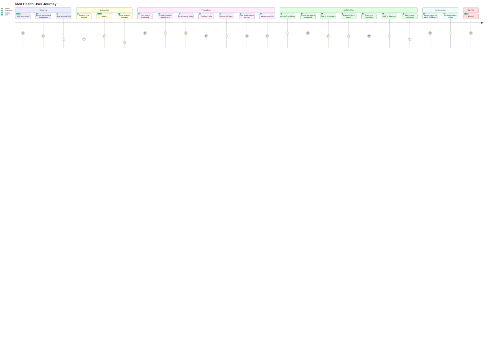

# Med Health application

### Team members:
* Malcolm
* Dylan
* Alex

### How to run the project:

1. Clone the repository

Option 1 (php composer):
`git clone https://github.com/Malcolm-D/Med-Health-Application.git`:
2. Run `composer install` to install dependencies
3. Create a database and update the .env file with the database credentials
4. 
5. Run 
```bash
openssl req -x509 -nodes -days 365 -newkey rsa:2048 \
    -keyout /etc/apache2/ssl/server.key \
    -out /etc/apache2/ssl/server.crt \
    -subj "/C=US/ST=State/L=City/O=Organization/OU=Department/CN=localhost" \
    -addext "basicConstraints=CA:FALSE" \
    -addext "subjectAltName=DNS:localhost,IP:127.0.0.1"
```  
to generate a self-signed certificate


Option 2 (php with docker):
2. Run `docker-compose up -d` or `docker compose up -d` to start the development server
3. Open `http://localhost:8080` or `https://localhost:8443` in your browser

Option 3 (Kubernetes with Helm):
1. Install kubectl and helm
2. Build and push Docker image:
   ```bash
   docker build -t malcolmston/spring2026-php:latest .
   docker push malcolmston/spring2026-php:latest
   ```
3. Apply Kubernetes manifests:
   ```bash
   kubectl apply -f k8s/
   ```
4. Port forward for local access:
   ```bash
   kubectl port-forward svc/spring2026-php 8080:80 8443:443
   ```
5. Open `http://localhost:8080` or `https://localhost:8443`

Option 4 (php with xampp):
2. Open `http://localhost/Med-Health-Application/` in your browser
3. Create a database and update the .env file with the database credentials
4. Run `php composer install` to install dependencies

> Note: if in docker run
> `docker exec -it <container_name> sh -c "mysql -u user -pPASSWORD db < /path/to/file.sql"`

6. next add all sql files to the database
    1. database.sql
    2. tables.sql
    3. trigger.sql
    4. function.sql
    5. view.sql
    6. procedure.sql
    7. event.sql
7. then apply all files in data dir

> users using ** docker compose ** with gain accsess to the mailpit server at `http://localhost:8025`

---

## Kubernetes Deployment

### Prerequisites
- kubectl CLI
- helm CLI
- Docker Hub account (for storing images)

### K8s Manifests (`k8s/` directory)
| File | Purpose |
|------|---------|
| `deployment.yaml` | PHP app deployment |
| `service.yaml` | ClusterIP service |
| `service-lb.yaml` | LoadBalancer for external access |
| `configmap.yaml` | Non-sensitive config |
| `secrets.yaml` | Database credentials |
| `mysql-deployment.yaml` | MySQL database |
| `mysql-pvc.yaml` | Persistent volume for MySQL |

### Quick Start
```bash
# Apply all manifests
kubectl apply -f k8s/

# Port forward for local access
kubectl port-forward svc/spring2026-php 8080:80 8443:443
```

### HashiCorp Vault (Secrets Management)

Install Vault with Helm:
```bash
helm install vault hashicorp/vault -n vault --create-namespace \
  --set 'injector.enabled=false' \
  --set 'server.dev.enabled=true' \
  --set 'server.dev.devRootToken=root'
```

Write secrets to Vault:
```bash
kubectl exec -n vault vault-0 -- vault kv put secret/spring2026 \
  DB_HOST=mysql \
  DB_USER=app \
  DB_PASS=app \
  DB_NAME=med_helth \
  NEWS_API_KEY=your_api_key \
  MAIL_HOST="" \
  MAIL_PORT="25"
```

Read secrets:
```bash
kubectl exec -n vault vault-0 -- vault kv get secret/spring2026
```

#### basic .env

> Go to 'https://newsapi.org/docs' to get an API key for the news api

```dotenv
NEWS_API_KEY=<api_key>
DB_HOST=mysql
DB_PORT=3306
DB_USER=app
DB_PASS=app
DB_NAME=med_helth
MAIL_HOST=mailpit
MAIL_PORT=1025
```

### routing diagram:



------


** What is the project about (background & motivation)? Why did you choose this idea? **

> The aim of this project is to create a unified system that connects patients to care. 
> Amidst a world where medications are prohibitively expensive and medical care becomes less and less
> accessible, there needs to be a system to help the average consumer.


** Who are the target users? **

> Patients, Doctors EMTs, and others in the medical field, such as psychologists.

** What is the context? **

> The medical field currently uses a couple of different systems for managing patient information.
> This creates significant gaps in how patients can receive care. The goal of this project is to create a website that reduces much of the stress that comes with visiting your medical professionals.

> Create a project that can not just bring patients closer to the field of medicine, but also bring some
> transparency to what your care will look like


** What are the websites will be able to serve and how? **
** Include a rough sketch of your idea (if available). **


> How will the tasks be distributed among teammates?

> we will all take 5 tables and make the php associated with them

`
Malcom - user, log, backup_log, drug_schedule, vaccines
Dylan - doctor_visit, visit, institution, allergy, user_allergy
Alex - perscription, perscription_item, parent, medicine, medicine_interaction
`
