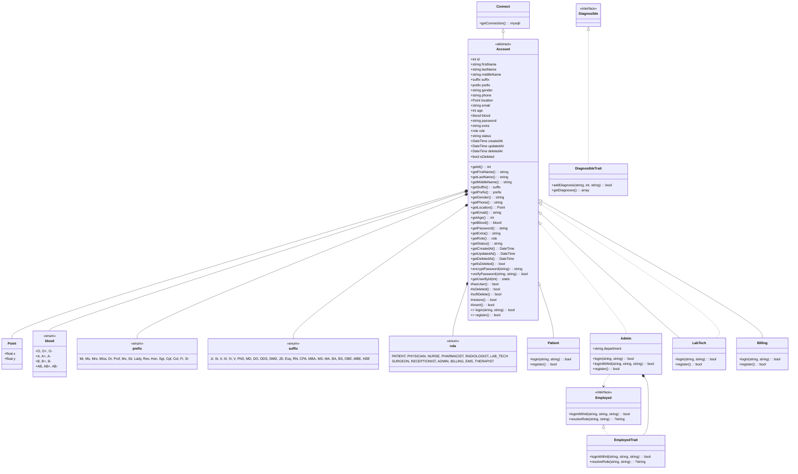

# Account PHP Classes

## Class Diagram

```mermaid
classDiagram
    class Connect {
        +getConnection(): mysqli
    }

    class Point {
        +float x
        +float y
    }

    class blood {
        <<enum>>
        +O, O+, O-
        +A, A+, A-
        +B, B+, B-
        +AB, AB+, AB-
    }

    class prefix {
        <<enum>>
        Mr, Ms, Mrs, Miss, Dr, Prof, Mx, Sir, Lady, Rev, Hon, Sgt, Cpl, Col, Fr, Sr
    }

    class suffix {
        <<enum>>
        Jr, Sr, II, III, IV, V, PhD, MD, DO, DDS, DMD, JD, Esq, RN, CPA, MBA, MS, MA, BA, BS, OBE, MBE, KBE
    }

    class role {
        <<enum>>
        PATIENT, PHYSICIAN, NURSE, PHARMACIST, RADIOLOGIST, LAB_TECH
        SURGEON, RECEPTIONIST, ADMIN, BILLING, EMS, THERAPIST
    }

    class Account {
        <<abstract>>
        +int id
        +string firstName
        +string lastName
        +string middleName
        +suffix suffix
        +prefix prefix
        +string gender
        +string phone
        +Point location
        +string email
        +int age
        +blood blood
        +string password
        +string extra
        +role role
        +string status
        +DateTime createdAt
        +DateTime updatedAt
        +DateTime deletedAt
        +bool isDeleted
        +getId(): int
        +getFirstName(): string
        +getLastName(): string
        +getMiddleName(): string
        +getSuffix(): suffix
        +getPrefix(): prefix
        +getGender(): string
        +getPhone(): string
        +getLocation(): Point
        +getEmail(): string
        +getAge(): int
        +getBlood(): blood
        +getPassword(): string
        +getExtra(): string
        +getRole(): role
        +getStatus(): string
        +getCreatedAt(): DateTime
        +getUpdatedAt(): DateTime
        +getDeletedAt(): DateTime
        +getIsDeleted(): bool
        +encryptPassword(string): string
        +verifyPassword(string, string): bool
        +getUserById(int): static
        #hasUser(): bool
        #isDeleted(): bool
        #softDelete(): bool
        #restore(): bool
        #insert(): bool
        <<abstract>> login(string, string): bool
        <<abstract>> register(): bool
    }

    class Patient {
        +login(string, string): bool
        +register(): bool
    }

    class Employed {
        <<interface>>
        +loginWithId(string, string, string): bool
        +resolveRole(string, string): ?string
    }

    class EmployedTrait {
        +loginWithId(string, string, string): bool
        +resolveRole(string, string): ?string
    }

    class Admin {
        +string department
        +login(string, string): bool
        +loginWithId(string, string, string): bool
        +register(): bool
    }

    class LabTech {
        +login(string, string): bool
        +register(): bool
    }

    class Billing {
        +login(string, string): bool
        +register(): bool
    }

    class Diagnosible {
        <<interface>>
    }

    class DiagnosibleTrait {
        +addDiagnosis(string, int, string): bool
        +getDiagnoses(): array
    }

    Connect <|-- Account
    Account *-- Point
    Account *-- blood
    Account *-- prefix
    Account *-- suffix
    Account *-- role

    Account <|-- Patient
    Account <|-- LabTech
    Account <|-- Billing

    Account <|.. Admin
    Admin ..> Employed

    Account <|.. LabTech

    Employed <|.. EmployedTrait
    Admin *-- EmployedTrait

    Diagnosible <|.. DiagnosibleTrait
```