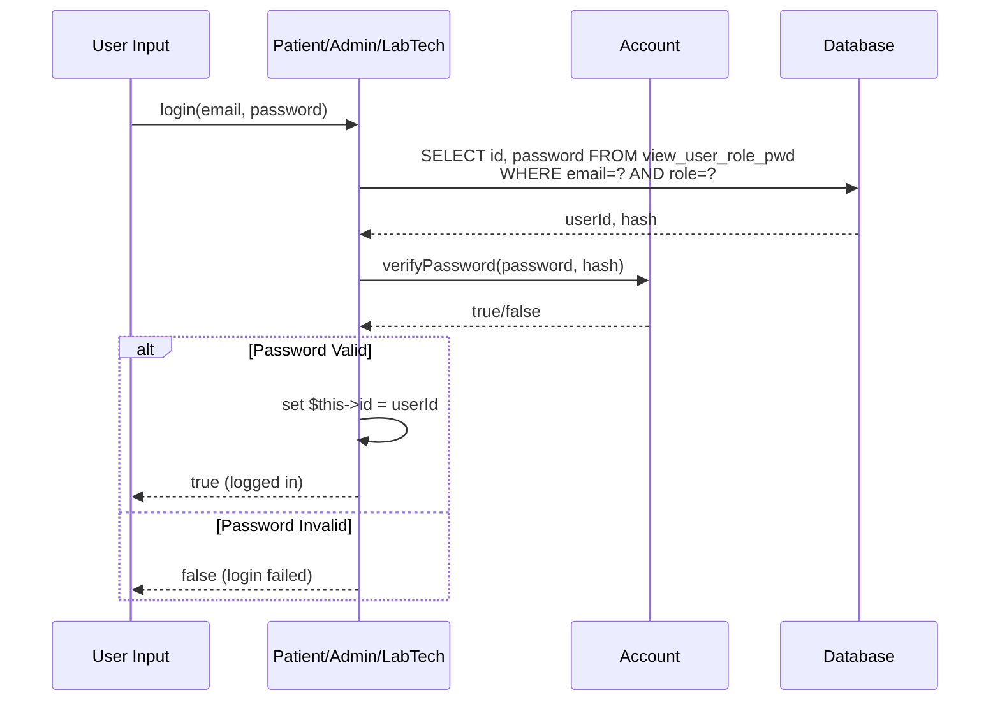
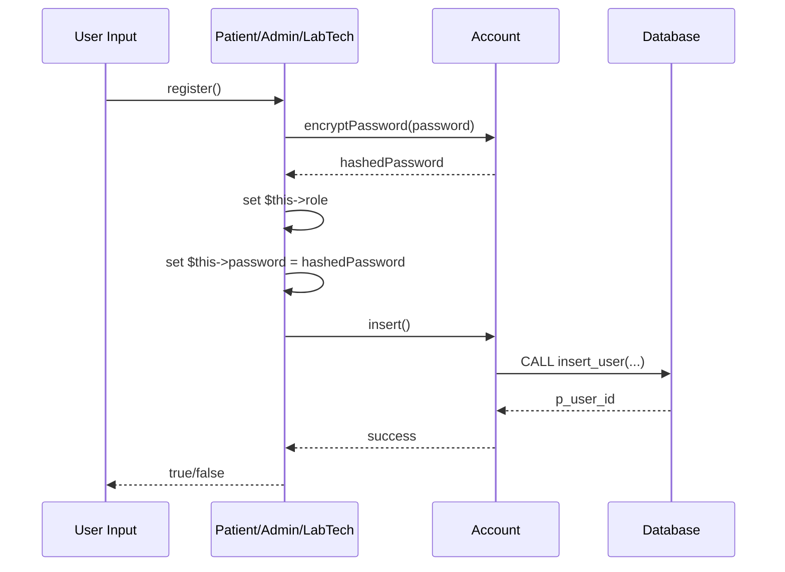

# Code Flow: Login & Registration

## Login Process

```mermaid
sequenceDiagram
    participant U as User Input
    participant P as Patient/Admin/LabTech
    participant A as Account
    participant DB as Database

    U->>P: login(email, password)
    P->>DB: SELECT id, password FROM view_user_role_pwd<br/>WHERE email=? AND role=?
    DB-->>P: userId, hash
    P->>A: verifyPassword(password, hash)
    A-->>P: true/false
    alt Password Valid
        P->>P: set $this->id = userId
        P-->>U: true (logged in)
    else Password Invalid
        P-->>U: false (login failed)
    end
```

## Registration Process

```mermaid
sequenceDiagram
    participant U as User Input
    participant P as Patient/Admin/LabTech
    participant A as Account
    participant DB as Database

    U->>P: register()
    P->>A: encryptPassword(password)
    A-->>P: hashedPassword
    P->>P: set $this->role
    P->>P: set $this->password = hashedPassword
    P->>A: insert()
    A->>DB: CALL insert_user(...)
    DB-->>A: p_user_id
    A-->>P: success
    P-->>U: true/false
```