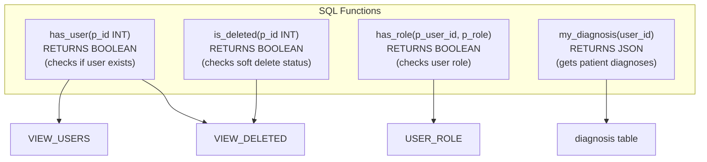
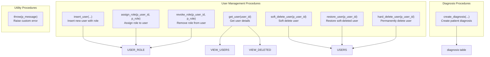
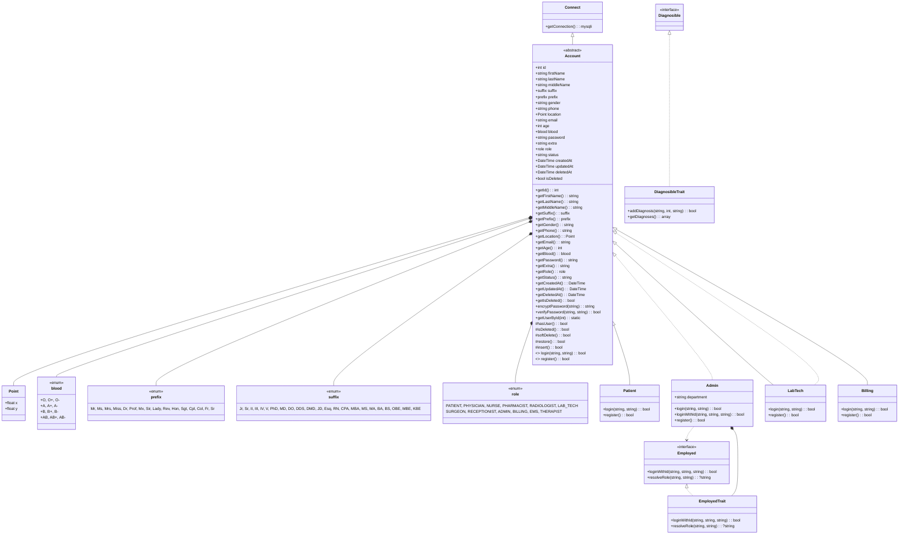
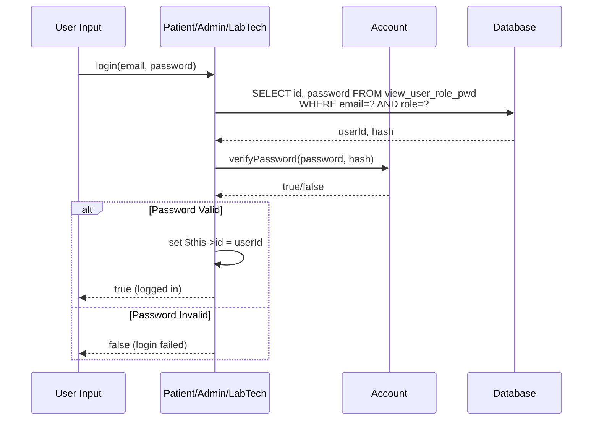
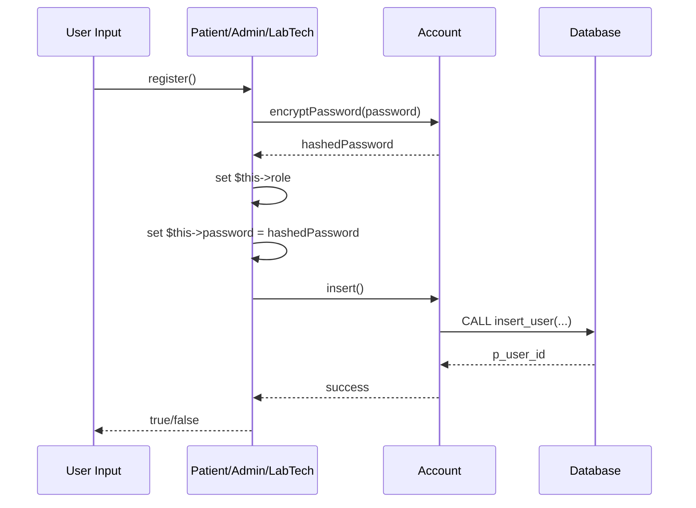

# Database & Application Diagrams

---
---


### SQL Functions



---

### SQL Stored Procedures



---

## Account PHP Class Hierarchy

### Class Diagram



---

### Account Flow: Login Process



---

### Account Flow: Registration Process



---

### Database to Application Mapping

```mermaid
flowchart LR
    subgraph "Database Layer"
        SQL_TABLES["SQL Tables<br/>(users, user_role, diagnosis, logs)"]
        SQL_VIEWS["SQL Views<br/>(view_user_roles, etc.)"]
        SQL_PROCS["Stored Procedures<br/>(insert_user, soft_delete_user, etc.)"]
        SQL_FUNCS["Functions<br/>(has_user, is_deleted, etc.)"]
    end

    subgraph "Application Layer"
        PHP_ACCOUNT["Account Class<br/>(base class)"]
        PHP_ROLES["role enum<br/>(PATIENT, ADMIN, etc.)"]
        PHP_SPECIFIC["Specific Classes<br/>(Patient, Admin, LabTech)"]
    end

    SQL_TABLES -->|SELECT/INSERT| PHP_ACCOUNT
    SQL_VIEWS -->|getUserById| PHP_ACCOUNT
    SQL_PROCS -->|CALL| PHP_ACCOUNT
    SQL_FUNCS -->|hasUser/isDeleted| PHP_ACCOUNT
    PHP_ROLES -->|role assignment| PHP_SPECIFIC
