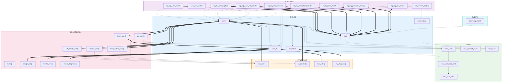

# Full SQL Object Relationships

## Complete Database Diagram

```mermaid
flowchart TB
    subgraph TABLES["TABLES"]
        USERS["users"]
        USER_ROLE["user_role"]
        DIAGNOSIS["diagnosis"]
        LOGS["logs"]
        BACKUP_LOGS["backup_logs"]
    end

    subgraph VIEWS["VIEWS"]
        V_USERS["view_users"]
        V_DELETED["view_deleted_users"]
        V_ROLE_PWD["view_user_role_pwd"]
        V_ROLES["view_user_roles"]
        V_TOTAL["total_view"]
    end

    subgraph FUNCTIONS["FUNCTIONS"]
        F_HAS_USER["has_user()"]
        F_IS_DELETED["is_deleted()"]
        F_HAS_ROLE["has_role()"]
        F_MY_DIAG["my_diagnosis()"]
    end

    subgraph PROCEDURES["PROCEDURES"]
        P_THROW["throw()"]
        P_INSERT["insert_user()"]
        P_ASSIGN["assign_role()"]
        P_REVOKE["revoke_role()"]
        P_GET["get_user()"]
        P_SOFT_DEL["soft_delete_user()"]
        P_RESTORE["restore_user()"]
        P_HARD_DEL["hard_delete_user()"]
        P_CREATE_DIAG["create_diagnosis()"]
    end

    subgraph TRIGGERS["TRIGGERS"]
        T_INSERT["trg_log_user_insert"]
        T_UPDATE["trg_log_user_update"]
        T_SOFT_DEL["trg_log_user_soft_delete"]
        T_RECOVER["trg_log_user_recover"]
        T_HARD_DEL["trg_log_user_hard_delete"]
        T_ROLE_INS["trg_log_role_insert"]
        T_ROLE_DEL["trg_log_role_delete"]
        T_PWD["trg_log_password_change"]
        T_USER_SOFT["user_soft_delete"]
        T_LOG_DEL["on_remove_of_log"]
    end

    subgraph EVENTS["EVENTS"]
        E_CLEAN["clean_log_month"]
    end

    %% Table Relationships
    USERS --> USER_ROLE
    USERS --> DIAGNOSIS
    USERS --> LOGS

    %% Tables to Views
    USERS -.-> V_USERS
    USERS -.-> V_DELETED
    USER_ROLE -.-> V_ROLE_PWD
    LOGS -.-> V_TOTAL
    BACKUP_LOGS -.-> V_TOTAL

    %% Views to Views
    V_USERS -.-> V_ROLE_PWD
    V_ROLE_PWD -.-> V_ROLES

    %% Tables to Functions
    USERS ==> F_HAS_USER
    USERS ==> F_IS_DELETED
    USER_ROLE ==> F_HAS_ROLE
    DIAGNOSIS ==> F_MY_DIAG

    %% Tables to Procedures
    USERS ==> P_INSERT
    USERS ==> P_SOFT_DEL
    USERS ==> P_RESTORE
    USERS ==> P_HARD_DEL
    USERS ==> P_GET
    USER_ROLE ==> P_ASSIGN
    USER_ROLE ==> P_REVOKE
    DIAGNOSIS ==> P_CREATE_DIAG

    %% Procedures to Functions
    P_SOFT_DEL -.-> F_HAS_USER
    P_RESTORE -.-> F_HAS_USER
    P_HARD_DEL -.-> F_HAS_USER
    P_GET -.-> F_IS_DELETED
    P_GET -.-> V_USERS
    P_GET -.-> V_DELETED

    %% Procedures to Tables
    P_INSERT ==> USER_ROLE

    %% Triggers fire on tables
    T_INSERT -.-> USERS
    T_UPDATE -.-> USERS
    T_SOFT_DEL -.-> USERS
    T_RECOVER -.-> USERS
    T_HARD_DEL -.-> USERS
    T_USER_SOFT -.-> USERS
    T_ROLE_INS -.-> USER_ROLE
    T_ROLE_DEL -.-> USER_ROLE
    T_PWD -.-> USERS
    T_LOG_DEL -.-> LOGS

    %% Triggers write to logs
    T_INSERT ==> LOGS
    T_UPDATE ==> LOGS
    T_SOFT_DEL ==> LOGS
    T_RECOVER ==> LOGS
    T_HARD_DEL ==> LOGS
    T_ROLE_INS ==> LOGS
    T_ROLE_DEL ==> LOGS
    T_PWD ==> LOGS
    T_LOG_DEL ==> BACKUP_LOGS

    %% Events
    E_CLEAN -.-> LOGS

    %% Color styling
    style TABLES fill:#e3f2fd,stroke:#1976d2,stroke-width:2px
    style VIEWS fill:#e8f5e9,stroke:#388e3c,stroke-width:2px
    style FUNCTIONS fill:#fff3e0,stroke:#f57c00,stroke-width:2px
    style PROCEDURES fill:#fce4ec,stroke:#c2185b,stroke-width:2px
    style TRIGGERS fill:#f3e5f5,stroke:#7b1fa2,stroke-width:2px
    style EVENTS fill:#e0f7fa,stroke:#0097a7,stroke-width:2px
```