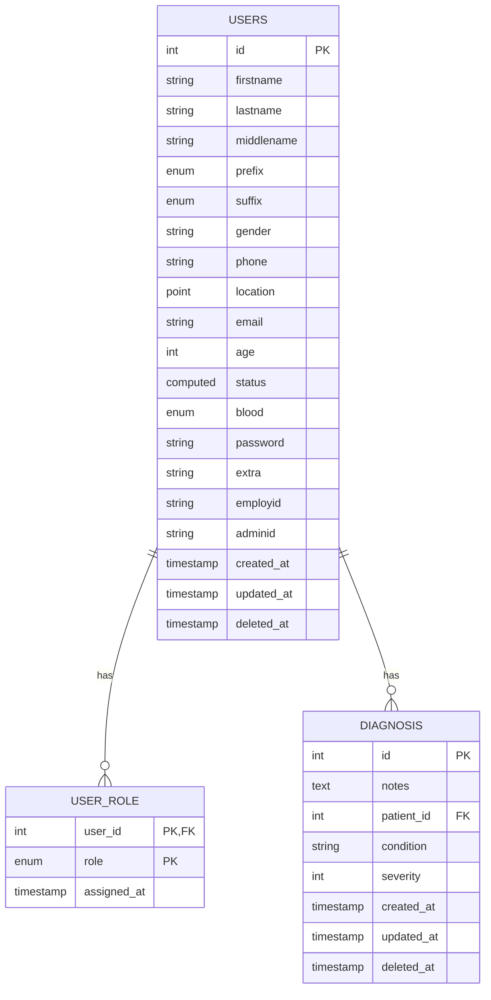
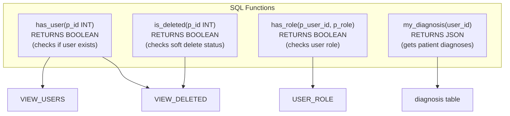
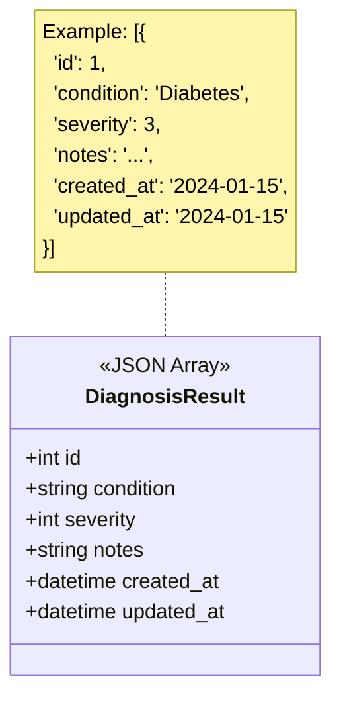

# SQL Functions

## Tables & Relationships

```mermaid
erDiagram
    USERS ||--o{ USER_ROLE : has
    USERS ||--o{ DIAGNOSIS : has

    USERS {
        int id PK
        string firstname
        string lastname
        string middlename
        enum prefix
        enum suffix
        string gender
        string phone
        point location
        string email
        int age
        computed status
        enum blood
        string password
        string extra
        string employid
        string adminid
        timestamp created_at
        timestamp updated_at
        timestamp deleted_at
    }

    USER_ROLE {
        int user_id PK, FK
        enum role PK
        timestamp assigned_at
    }

    DIAGNOSIS {
        int id PK
        text notes
        int patient_id FK
        string condition
        int severity
        timestamp created_at
        timestamp updated_at
        timestamp deleted_at
    }
```

## Function Flow

```mermaid
flowchart TB
    subgraph "SQL Functions"
        HAS_USER["has_user(p_id INT)<br/>RETURNS BOOLEAN<br/>(checks if user exists)"]
        IS_DELETED["is_deleted(p_id INT)<br/>RETURNS BOOLEAN<br/>(checks soft delete status)"]
        HAS_ROLE["has_role(p_user_id, p_role)<br/>RETURNS BOOLEAN<br/>(checks user role)"]
        MY_DIAGNOSIS["my_diagnosis(user_id)<br/>RETURNS JSON<br/>(gets patient diagnoses)"]
    end

    HAS_USER --> VIEW_USERS
    HAS_USER --> VIEW_DELETED
    IS_DELETED --> VIEW_DELETED
    HAS_ROLE --> USER_ROLE
    MY_DIAGNOSIS --> DIAGNOSIS["diagnosis table"]
```

## Non-Deterministic Function Return Types

### my_diagnosis() Returns JSON Array

```mermaid
classDiagram
    class DiagnosisResult {
        <<JSON Array>>
        +int id
        +string condition
        +int severity
        +string notes
        +datetime created_at
        +datetime updated_at
    }

    note for DiagnosisResult "Example: [{<br/>&nbsp;&nbsp;'id': 1,<br/>&nbsp;&nbsp;'condition': 'Diabetes',<br/>&nbsp;&nbsp;'severity': 3,<br/>&nbsp;&nbsp;'notes': '...',<br/>&nbsp;&nbsp;'created_at': '2024-01-15',<br/>&nbsp;&nbsp;'updated_at': '2024-01-15'<br/>}]"
```