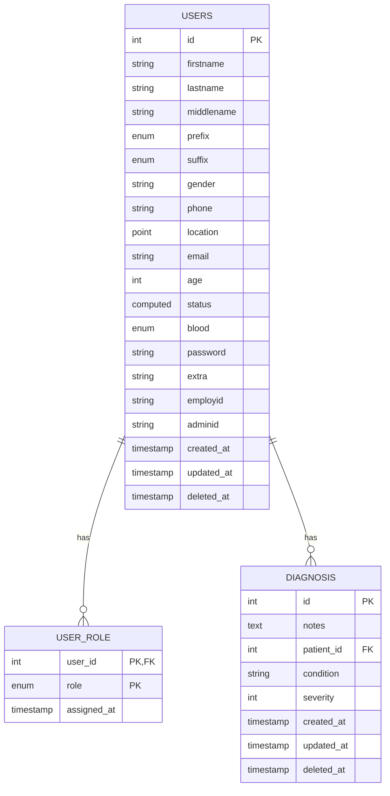
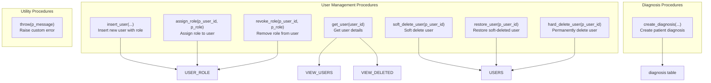
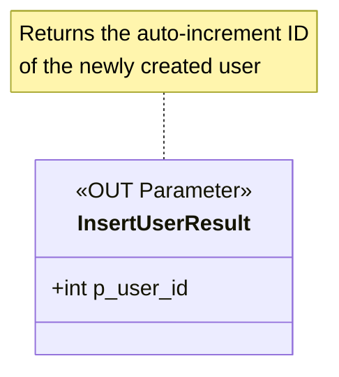
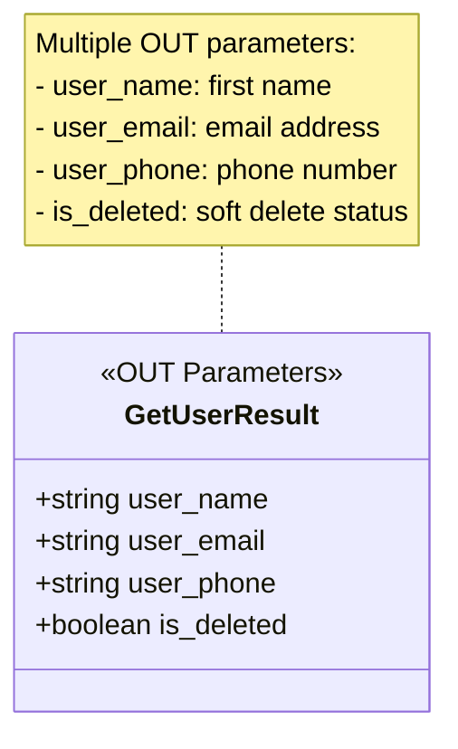
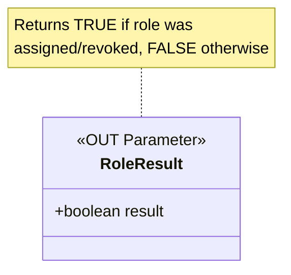
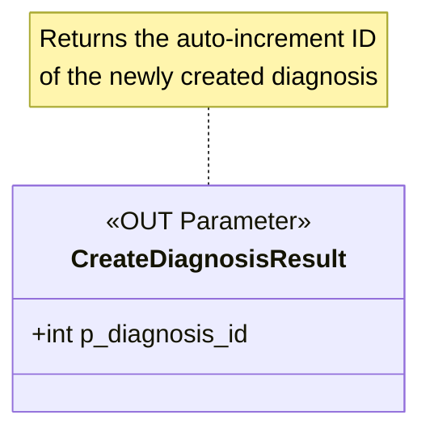

# SQL Stored Procedures

## Tables & Relationships

## Procedure Flow

## Procedure Return Types

### insert_user() Returns User ID

### get_user() Returns User Details

### assign_role() / revoke_role() Return Boolean

### create_diagnosis() Returns Diagnosis ID

