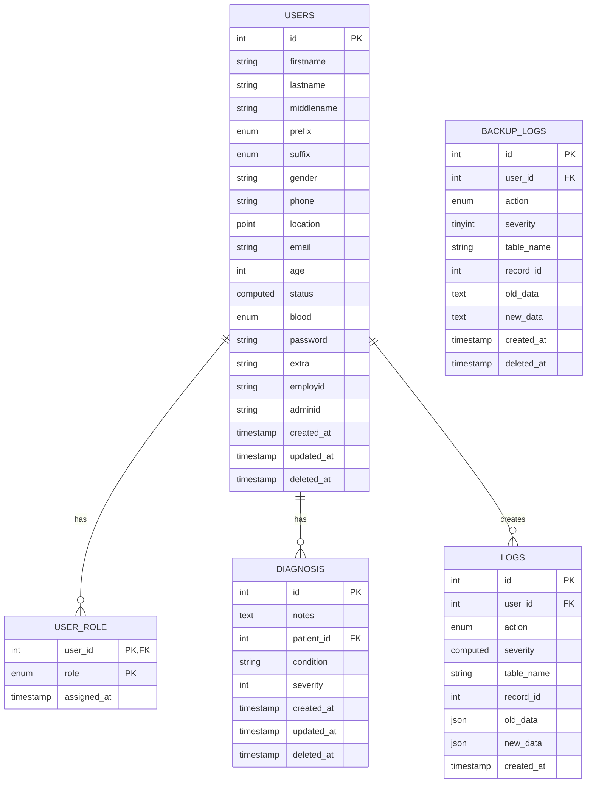

# Database Tables

## ER Diagram

```mermaid
erDiagram
    USERS ||--o{ USER_ROLE : has
    USERS ||--o{ DIAGNOSIS : has
    USERS ||--o{ LOGS : creates

    USERS {
        int id PK
        string firstname
        string lastname
        string middlename
        enum prefix
        enum suffix
        string gender
        string phone
        point location
        string email
        int age
        computed status
        enum blood
        string password
        string extra
        string employid
        string adminid
        timestamp created_at
        timestamp updated_at
        timestamp deleted_at
    }

    USER_ROLE {
        int user_id PK, FK
        enum role PK
        timestamp assigned_at
    }

    DIAGNOSIS {
        int id PK
        text notes
        int patient_id FK
        string condition
        int severity
        timestamp created_at
        timestamp updated_at
        timestamp deleted_at
    }

    LOGS {
        int id PK
        int user_id FK
        enum action
        computed severity
        string table_name
        int record_id
        json old_data
        json new_data
        timestamp created_at
    }

    BACKUP_LOGS {
        int id PK
        int user_id FK
        enum action
        tinyint severity
        string table_name
        int record_id
        text old_data
        text new_data
        timestamp created_at
        timestamp deleted_at
    }
```
